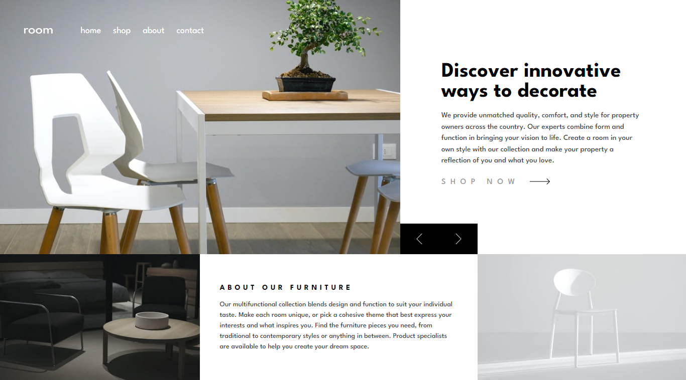
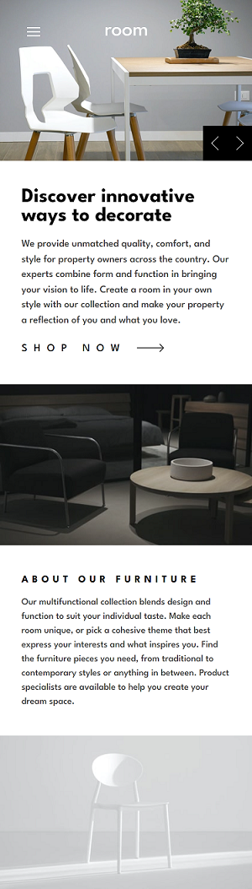

# Frontend Mentor - Room homepage solution

This is a solution to the [Room homepage challenge on Frontend Mentor](https://www.frontendmentor.io/challenges/room-homepage-BtdBY_ENq).

## Table of contents

- [Frontend Mentor - Room homepage solution](#frontend-mentor---room-homepage-solution)
  - [Table of contents](#table-of-contents)
  - [Overview](#overview)
    - [Screenshot](#screenshot)
    - [Links](#links)
  - [My process](#my-process)
    - [Built with](#built-with)
  - [Author](#author)

## Overview

### Screenshot

### Links

- Solution URL: [https://github.com/ajoykumardas12/room-homepage]
- Live Site URL: [https://room-landing.vercel.app/]

## My process

### Built with

- Semantic HTML5 markup
- Tailwind CSS

## Author

- Website - [Ajoy Kumar Das](https://ajoykumardas.vercel.app/)
- Frontend Mentor - [ajoykumardas12](https://www.frontendmentor.io/profile/ajoykumardas12)
- Twitter - [AjoykrDas_](https://twitter.com/AjoykrDas_)